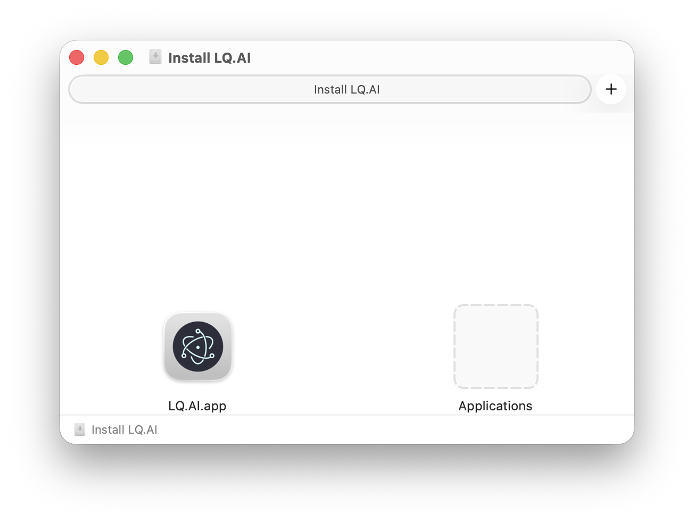
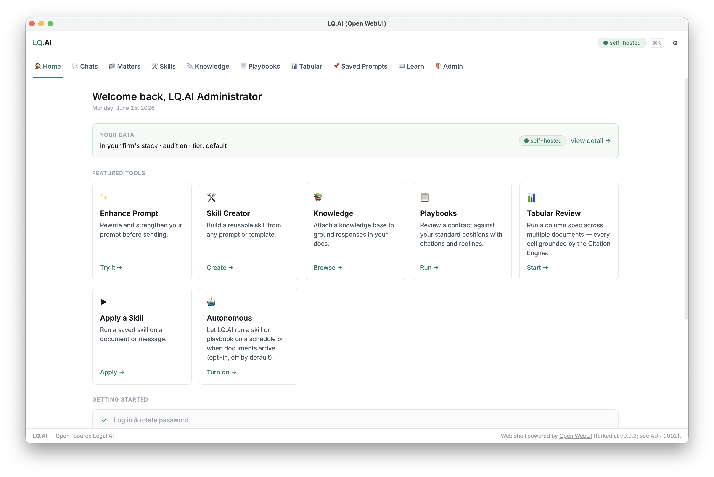
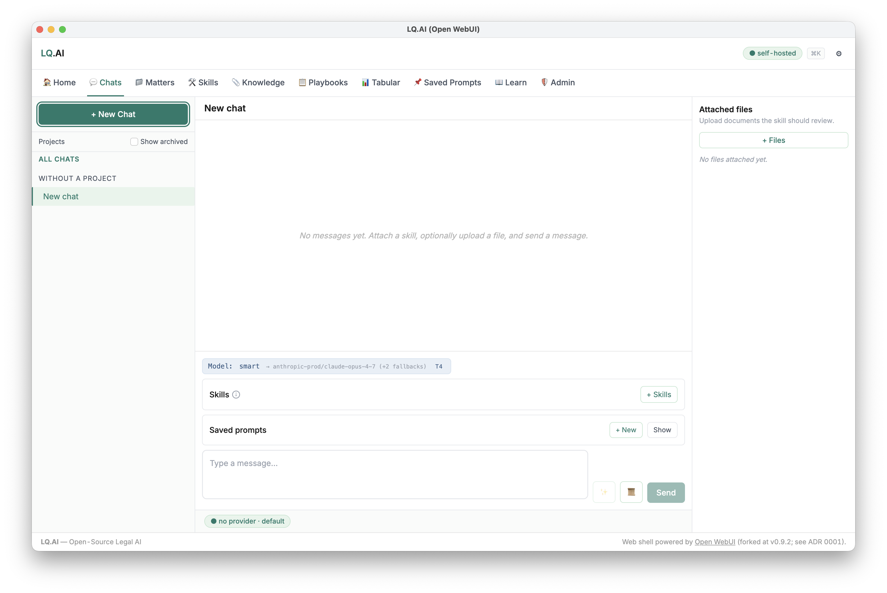
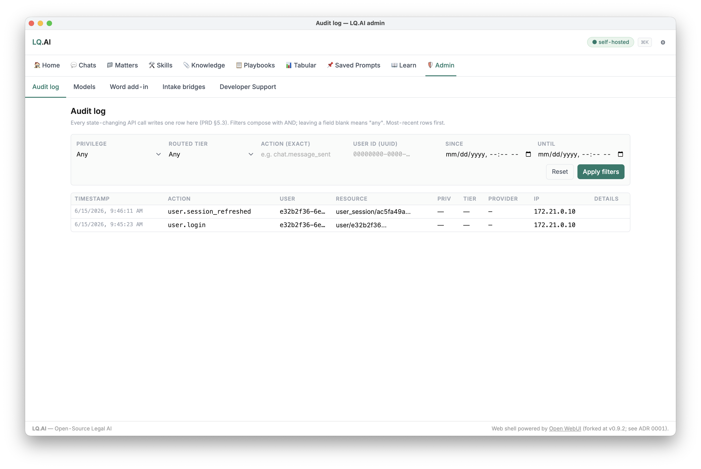

# Install LQ.AI on your Mac

LQ.AI for Mac is a one-app install: download it, open it, set a password, and you're working — **no
terminal, no GitHub, no config files**.

> **What you need**
> - A **Mac with Apple Silicon** (M1/M2/M3/M4).
> - **Docker Desktop** installed and running — LQ.AI uses it to run its engine on your machine.
>   **[Download Docker Desktop for Apple Silicon →](https://desktop.docker.com/mac/main/arm64/Docker.dmg)**
>   (or browse [docker.com/products/docker-desktop](https://www.docker.com/products/docker-desktop/)).
>   If Docker isn't installed or running, LQ.AI tells you and links you to it.
> - **~12 GB of free disk** for the engine images, and an internet connection for the first run.

Everything LQ.AI does runs **locally on your Mac**. Your documents never leave your computer unless you
add a cloud AI provider key and choose a cloud model.

---

## 1. Download

Go to the **latest desktop release** on the
[LQ.AI Releases page](https://github.com/LegalQuants/lq-ai/releases) and download the
**`LQ.AI-<version>-arm64.dmg`**.

## 2. Install

Double-click the downloaded `.dmg`. A window opens — **drag the LQ.AI icon onto the Applications
folder**, then eject the disk image.



*The opened `.dmg` — drag **LQ.AI.app** onto **Applications**, then eject the disk image.*

Open LQ.AI from your **Applications** folder (or Launchpad). Because the app is **signed and notarized
by Apple** (Developer ID: Tucuxi, Inc.), it opens normally — no "unidentified developer" warning.


*Because the app is signed + notarized (Apple Developer ID), macOS confirms it **checked the app and found no malicious software** — click **Open**.*

## 3. One-time setup


*The one-time setup wizard — set a password for `admin@lq.ai` and click **Start LQ.AI**. No provider key is needed to start (that's BYOK, added later in the app).*

The first time you open LQ.AI, a short **Welcome** wizard appears:

- **Set your password.** Your login is **`admin@lq.ai`** (shown on screen); choose a password of at
  least 12 characters. You can change the email and password later in **Settings → Account**.

Click **Start LQ.AI**. The first start **downloads the engine and document-processing models** — a few
minutes the first time only — and shows live progress (e.g. *"5/8 services ready"*). When it reaches
**Running**, you're set.

> **Note:** the wizard does **not** ask for any AI provider key. The stack boots fully healthy with no
> provider keys at all. You add a key in-app after first launch — see step 5.

> **Note:** those first-run downloads are LQ.AI's **document-reading models** (search, highlighting,
> OCR) — not the chat AI. You don't have to wait for them to finish to sign in; they keep loading in
> the background and only matter when you upload documents.

## 4. Log in


*Once the stack is healthy the panel shows **Running** — click **Open LQ.AI**.*

Click **Open LQ.AI** and sign in with **`admin@lq.ai`** and the password you set. You'll land on the
home workspace.


*Sign in with `admin@lq.ai` and the password you set in setup.*



*The Home screen after you log in — everything runs on your Mac (note the **self-hosted** badge). The Featured Tools grid is your jumping-off point: Enhance Prompt, Skill Creator, Knowledge, Playbooks, Tabular Review, Apply a Skill, and Autonomous.*

## 5. Add a provider key before your first chat (BYOK)

LQ.AI is **bring-your-own-key**: chat and skills call AI providers (OpenAI, Anthropic, …) using **your**
API key, which you add inside the app. **The stack runs without a key, but chat will not work until you
add one.**



*Until you add a provider key, a new chat shows **"no provider · default"** — add one OpenAI or Anthropic key in **Configure** and it's hot-applied (no restart).*

To add a key:

1. Open the **Configure** area (admin) in the app.
2. Add an **OpenAI** and/or **Anthropic** API key (whichever provider you use).
3. Save. Keys are **hot-applied with no restart** — your next chat uses them immediately.

Your provider keys are held by the engine's Inference Gateway on your Mac; the launcher never stores
them and the setup wizard never asks for them.

---

## Everyday use

The LQ.AI app window is your **control panel**:

- **Open LQ.AI** — opens the workspace (once the engine is Running).
- **Start / Stop** — start or stop the engine. Stopping frees up your Mac's resources; your data is
  kept and is there next time you Start.
- **Logs** — a live view of what the engine is doing, handy if something looks stuck.
- **Reset…** — erases all LQ.AI data on this Mac and re-runs first-time setup (two clicks to confirm).
  Use this only if you want to start completely fresh.

Inside the workspace, the Featured Tools are where the work happens — apply a **Skill** to a document,
build a **Knowledge** base, run **Tabular Review** across many files, or check a contract against your
standard positions with a **Playbook**:


*For example, **Playbooks** — review a contract against your standard positions; each position is classified and redlined.*

Because LQ.AI is self-hosted, it's also fully auditable: every state-changing action is recorded.



*Every state-changing action is written to the **Admin → Audit log** — self-hosted and fully auditable.*

You can quit the app when you're done. Re-opening goes straight to the control panel — the setup wizard
only runs the very first time.

App data lives at `~/Library/Application Support/lq-ai-desktop/` (an encrypted `config.enc` plus a
chmod-600 `.env`). The bundled compose file is at
`/Applications/LQ.AI.app/Contents/Resources/docker-compose.release.yml`.

---

## Troubleshooting

- **"Docker is not running."** Start **Docker Desktop** (the whale icon in your menu bar), wait until it
  says *Running*, then click **Start** in LQ.AI.
- **First start is slow.** Normal — the engine images and document models download once. Watch the live
  progress; you can sign in as soon as it says **Running**.
- **Chat says it has no model / fails to answer.** You haven't added a provider key yet — add one in
  **Configure** (step 5 above). Chat needs at least one provider key.
- **Forgot your password?** It can be reset from a terminal (advanced):
  ```bash
  docker compose -f "/Applications/LQ.AI.app/Contents/Resources/docker-compose.release.yml" \
    -p lq-ai-desktop --env-file "$HOME/Library/Application Support/lq-ai-desktop/.env" \
    exec -T api python -m app.cli reset-admin-password --email admin@lq.ai --password 'YourNewPass123!' --no-force-change
  ```

---

## Prefer the command line?

If you're comfortable with Docker, you can skip the app and run the same stack directly with
[`docker-compose.release.yml`](../docker-compose.release.yml) and
[`.env.release.example`](../.env.release.example) — see the
[Quick Start](../README.md#quick-start) in the README.
